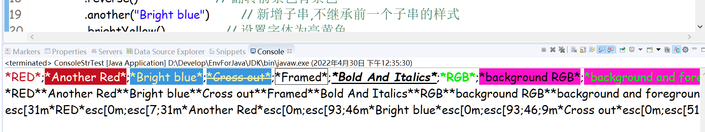
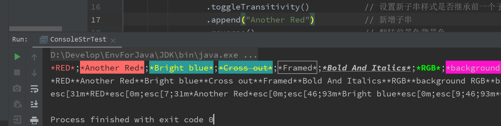

### 为Eclipse、IDEA、CMD输出的文本着色

```java
ConsoleStr font = new ConsoleStr();
font.setPostfix("*");
font.setPrefix("*");
font.setDelimiter(";");
ConsoleStr text = font
        .red("RED")                     // 设置子串为红色
        .toggleTransitivity()           // 设置新子串样式是否继承前一个子串样式(打开)
        .append("Another Red")          // 新增子串
        .reverse()                      // 翻转前景色背景色
        .another("Bright blue")         // 新增子串,不继承前一个子串的样式
        .brightYellow()                 // 设置字体为亮黄色
        .bgmCyan()                      // 设置背景色为青色
        .append("Cross out")            // 新增子串,继承于上一个子串样式
        .crossed()                      // 设置字体删除线
        .toggleTransitivity()           // 设置新子串样式是否继承前一个子串样式(关闭)
        .another()                      // 新增子串,不继承前一个子串的样式
        .framed("Framed")               // 设置子串边框
        .toggleAlwaysReturnNewOne()     // 总是返回新的实例
        .underline("Underline")         // 设置下划线
        .toggleAlwaysReturnNewOne()     // 总是返回新的实例，这里关闭后获取到的会是Underline的实例
        .bold("Bold And Italics")       // 加粗
        .italics()                      // 斜体
        .toggleAlwaysReturnNewOne(false)    // 关闭总是返回新的实例
        .another("RGB")                 // 获取新的实例
        .color(0, 238, 0)      		   // 设置字体颜色(RGB)
        .bold()                         // 加粗
        .another("background RGB")      // 获取新的实例
        .background(255, 17, 204)       // 设置背景颜色(RGB)
        .another("background and foreground RGB")
        .background(255, 17, 204).color(0, 238, 0)  // 设置前景/背景颜色(RGB)
        .another("RGB").color(new ConsoleStr.RGB(0,255,0))
        .underline();                           // 设置下划线
//eclipse需要安装 ANSI Escape in Console 插件
System.out.println(text);                       // 着色后的子串
System.out.println(text.toOriginalStr());       // 获取源子串
System.out.println(text.toEscapeString());      // 获取ANSI escape code子串
```

- Eclipse console

  

- IDEA console

  


